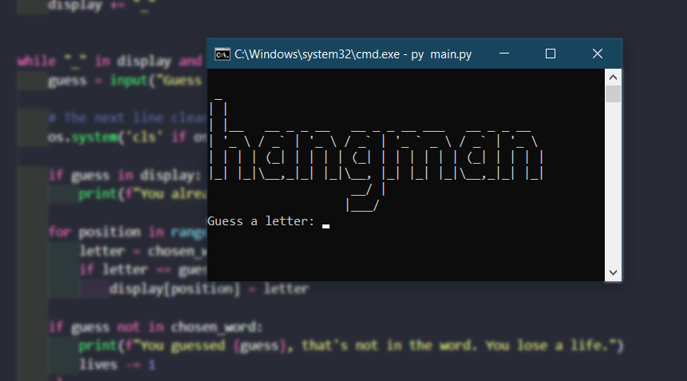

##  The Hangman Game


A simple hangman game made for the 100 days of code - The Complete Python Bootcamp with Dr. Angela Yu. The game was developed during day 7, first we were encouraged to build a flowchart to develop the logic and after that, we were provided with tasks that evolved until reached the final project. 

Here are all the steps provided in the lesson and how the code looked in each one of them: 

### ✅ `STEP 1:`
1. Randomly choose a word from the word_list and assign it to a variable called chosen_word.
2. Ask the user to guess a letter and assign their answer to a variable called guess. Make guess lowercase.
3. Check if the letter the user guessed (guess) is one of the letters in the chosen_word.

<details><summary> Click to see the code</summary>

```python
import random
word_list = ["aardvark", "baboon", "camel"]

#1
chosen_word = random.choice(word_list)

#2
guess = input("Guess a letter: ").lower()

#3
for letter in chosen_word:
    if guess == letter:
        print("Right")
    else:
        print("Wrong")
```
</details><br>

### ✅ `STEP 2:`
1. Create an empty List called display.
#For each letter in the chosen_word, add a "\_" to 'display'. 
So if the chosen_word was "apple", display should be ["\_", "\_", "\_", "\_", "\_"] with 5 "\_" representing each letter to guess.
2. Loop through each position in the chosen_word;
If the letter at that position matches 'guess' then reveal that letter in the display at that position. e.g. If the user guessed "p" and the chosen word was "apple", then display should be ["\_", "p", "p", "\_", "\_"].
3. Print 'display' and you should see the guessed letter in the correct position and every other letter replace with "\_".

<details><summary> Click to see the code</summary>

```python
import random
word_list = ["aardvark", "baboon", "camel"]
chosen_word = random.choice(word_list)

#Testing code
print(f'Pssst, the solution is {chosen_word}.')

# 1
display = []
word_length = len(chosen_word)
for _ in range(word_length):
    display += "_"

guess = input("Guess a letter: ").lower()

# 2
for position in range(word_length):
	letter = chosen_word[position]
	if letter == guess:
		display[position] = letter

# 3
print(display)
```
</details><br>

### ✅ `STEP 3:`

1. Use a while loop to let the user guess again. The loop should only stop once the user has guessed all the letters in the chosen_word and 'display' has no more blanks ("_"). Then you can tell the user they've won.

<details><summary> Click to see the code</summary>

```python
import random
word_list = ["aardvark", "baboon", "camel"]
chosen_word = random.choice(word_list)
word_length = len(chosen_word)

#Testing code
print(f'Pssst, the solution is {chosen_word}.')

#Create blanks
display = []
for _ in range(word_length):
    display += "_"


#Check guessed letter
# 1
while "_" in display:
    guess = input("Guess a letter: ").lower()

    for position in range(word_length):
        letter = chosen_word[position]

        if letter == guess:
            display[position] = letter
            
    print(display)

if "_" not in display:
    print("You win!")
```
</details><br>

### ✅ `STEP 4:`

1. Create a variable called 'lives' to keep track of the number of lives left. Set 'lives' to equal 6.
2. If guess is not a letter in the chosen_word, then reduce 'lives' by 1. If lives goes down to 0 then the game should stop and it should print "You lose."
3. Print the ASCII art from 'stages' that corresponds to the current number of 'lives' the user has remaining.

<details><summary> Click to see the code</summary>

```python
import random

stages = ['''
  +---+
  |   |
  O   |
 /|\  |
 / \  |
      |
=========
''', '''
  +---+
  |   |
  O   |
 /|\  |
 /    |
      |
=========
''', '''
  +---+
  |   |
  O   |
 /|\  |
      |
      |
=========
''', '''
  +---+
  |   |
  O   |
 /|   |
      |
      |
=========''', '''
  +---+
  |   |
  O   |
  |   |
      |
      |
=========
''', '''
  +---+
  |   |
  O   |
      |
      |
      |
=========
''', '''
  +---+
  |   |
      |
      |
      |
      |
=========
''']

word_list = ["aardvark", "baboon", "camel"]
chosen_word = random.choice(word_list)
word_length = len(chosen_word)
lives = 6 

print(f'Pssst, the solution is {chosen_word}.')

display = []
for _ in range(word_length):
    display += "_"


while "_" in display and lives > 0:
    guess = input("Guess a letter: ").lower()
    for position in range(word_length):
        letter = chosen_word[position]
        if letter == guess:
            display[position] = letter
    if guess not in chosen_word:
        lives -= 1

    if "_" not in display:
        print("***You win.***")
    elif lives == 0:
        print("You lose.")
    #Join all the elements in the list and turn it into a String.
    print(f"{' '.join(display)}")
    print(stages[lives])
```
</details><br>

### ✅ `STEP 5 (FINAL PROJECT)`

1. Update the word list to use the 'word_list' from hangman_words.py
2. Import the stages from hangman_art.py and make this error go away.
3. Import the logo from hangman_art.py and print it at the start of the game.
4. If the user has entered a letter they've already guessed, print the letter and let them know.
5. If the letter is not in the chosen_word, print out the letter and let them know it's not in the word.

You can check the final project in the [main.py](main.py) file in the repository